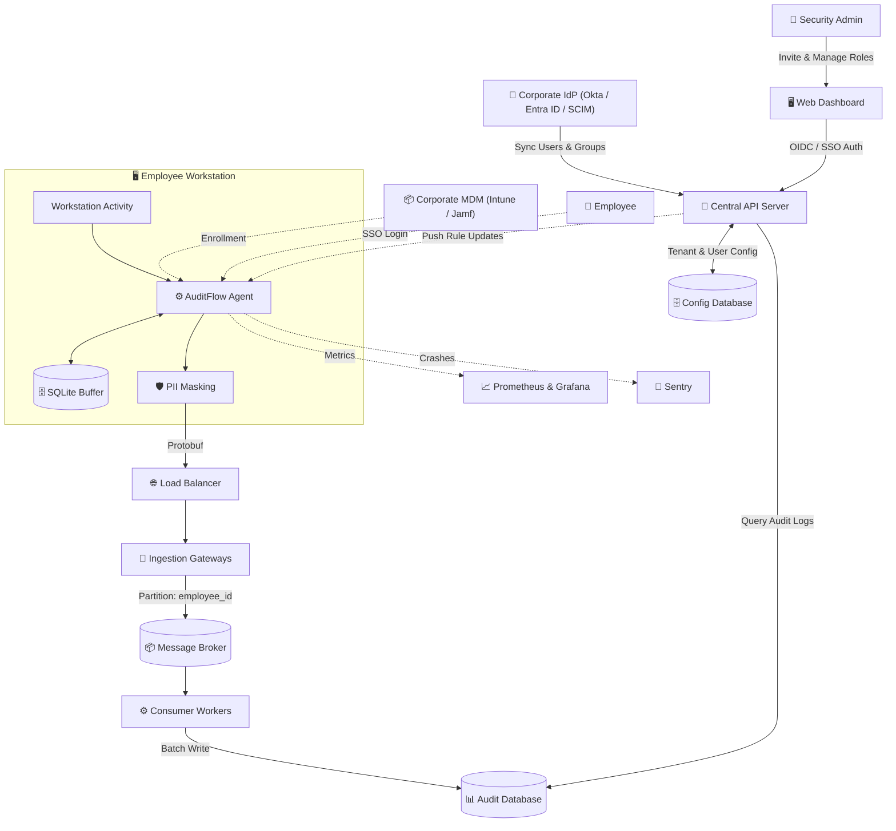
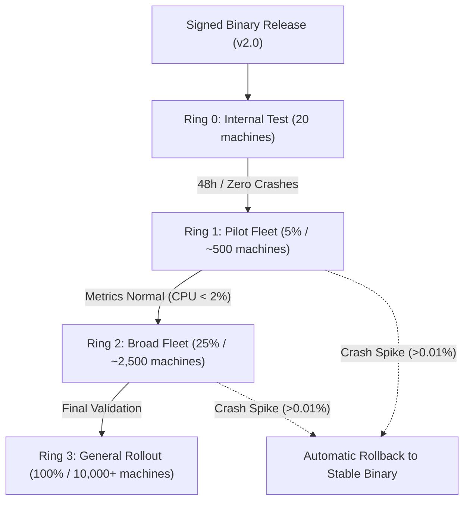

# TODO: Production Rollout & High-Load Architecture Plan

This document outlines the engineering roadmap to scale **AuditFlow** from the current prototype into a production-ready system supporting 10,000+ to 100,000+ employee workstations.

---

## 1. Target Production Architecture

---

## 2. Component Justifications

* **Go Agent & SQLite Buffer**: Go provides a single native static binary with zero runtime dependencies and minimal footprint (<30 MB RAM, <2% CPU). Embedded SQLite (WAL mode) safely queues audit popups locally during VPN/network drops and drains with jitter upon reconnection.
* **Identity, Auth & Device Enrollment**: Hybrid authentication model supporting zero-touch silent MDM enrollment (machine tokens) for managed corporate fleets, and interactive corporate SSO (OIDC/SAML) with hardware-bound, rotatable device tokens for self-serve onboarding.
* **Client-Side PII Masking**: Privacy by design. Sensitive data (passwords, tokens, credit cards with Luhn verification) is redacted on the endpoint before network egress to comply with security standards.
* **Message Broker**: Buffers high-throughput bursts (e.g., morning login spikes) and partitions events by `employee_id` to guarantee in-order event processing without database overload.
* **Dual Database Layer**:
  * **Audit Database (Columnar/Time-Series)**: High-throughput batch writes and sub-second analytical search across billions of historical audit popups.
  * **Config Database (Relational/ACID)**: Transactional storage for company accounts, user access, device registry, and versioned compliance rules.
* **Central API Server & Web Dashboard**: Decouples UI presentation from storage engines, handles user authentication, serves audit queries, and orchestrates live rule updates.

---

## 3. Actionable Engineering Roadmap

### 1. Endpoint Agent Hardening
* [ ] **Native OS Service Wrappers**: Package the Go agent as a native background service (Windows Service, macOS LaunchDaemon, Linux systemd) with auto-start on boot, non-interactive system privileges, and automatic restart on crash.
* [ ] **Local SQLite Offline Buffer**: Store generated audit popups in an embedded SQLite database (WAL mode) when the network is unavailable, draining the queue with randomized jitter upon reconnection to avoid server overload.
* [ ] **Client-Side PII Masking**: Add pre-compiled regex filters and Luhn checks directly on the agent to redact passwords, bearer tokens, and credit card numbers from clipboard and OCR text before sending telemetry over the network.
* [ ] **Dual-Binary A/B Auto-Updater**: Build a supervisor that downloads signed agent binaries in the background and automatically rolls back if the new binary crashes or exceeds resource limits (CPU > 2%, RAM > 35 MB).

### 2. High-Throughput Ingestion & Event Broker
* [ ] **Protobuf Contract Versioning & Schema Registry**: Version Protobuf contracts (`v1`, `v2`) with backward/forward compatibility rules so that older and newer agent versions can run simultaneously without breaking the central server.
* [ ] **Stateless Ingestion Gateways**: Deploy Go ingestion gateways behind a load balancer to handle TLS encryption, validate agent device tokens, and stream Protobuf payloads directly into the message broker.
* [ ] **Message Broker**: Configure topics with fixed partition counts, routing events by key `employee_id` to guarantee strict sequential processing per employee session while absorbing traffic spikes.

### 3. Scalable Storage & Database Layer
* [ ] **Audit Database**: Store audit popups in a high-throughput time-series/columnar database using batch writes from the message broker and date partitioning for fast search across billions of records.
* [ ] **Config Database**: Store company accounts, employee directory records, device registrations, and versioned rule definitions in a relational database with ACID transactional guarantees.

### 4. Dynamic Rule Management & Web Dashboard
* [ ] **Central Rule Management Service**: Create an API service to validate, version, and manage compliance rules with syntax and ReDoS checks.
* [ ] **Zero-Downtime Rule Hot-Reloading**: Push updated rules to running agents via gRPC/WebSocket, swapping rule trees atomically in memory (`atomic.Pointer`) without process restart or dropped ticks.
* [ ] **Web Dashboard**: Provide a web interface to inspect audit popups, filter by employee or rule, view statistics, and edit active rules.

### 5. Identity, Authentication & Device Onboarding
* [ ] **Corporate SSO & OIDC / SAML 2.0**: Integrate corporate identity providers (Okta, Microsoft Entra ID, Google Workspace) for dashboard access and interactive agent sign-in.
* [ ] **Automated SCIM Directory Sync & Bulk Invitations**: Implement SCIM 2.0 user provisioning and CSV import to automatically create, update, and deprovision employee accounts and department groups.
* [ ] **Zero-Touch Enterprise MDM Enrollment**: Enable silent agent registration during MSI/PKG installation via corporate enrollment tokens and machine certificates pushed by Microsoft Intune or Jamf Pro.
* [ ] **Device Fingerprinting & Rotatable Device Keys**: Generate cryptographically signed, short-lived device tokens bound to workstation hardware UUID and OS user account with automatic background rotation.
* [ ] **Granular RBAC & Instant Token Revocation**: Enforce role-based access control (Admin, Compliance Officer, Auditor, Manager) and implement immediate device token revocation upon employee offboarding or device loss.

### 6. Staged Agent Rollout Strategy (Canary Deployment)

* [ ] **Enterprise Packaging**: Build signed MSI (Windows GPO/Intune), PKG (macOS Jamf), and DEB/RPM packages for silent mass deployment across corporate fleets.
* [ ] **Canary Agent Binary Rollout**: Staged rollout of new agent binary versions across 4 deployment rings (Internal -> 5% -> 25% -> 100%) with automated rollback if crash rates exceed 0.01%.

### 7. Observability & Monitoring
* [ ] **Prometheus Metrics & Grafana Dashboards**: Track agent fleet uptime (>99.9%), rule evaluation latency (p99 < 5ms), ingestion rate, and agent resource usage (CPU < 2%, RAM < 35 MB).
* [ ] **Sentry Crash Reporting**: Collect minidumps and stack traces on unhandled panics for rapid triage and alerting.

---

## 4. Team Workstreams & Ownership

| Workstream | Team Focus | Key Responsibilities |
| :--- | :--- | :--- |
| **Agent & OS Core** | Endpoint Systems Engineering | Native OS service hooks, SQLite offline queue, PII sanitizer, A/B updater |
| **Platform & Ingestion** | Cloud Infrastructure & Data | Ingestion gateways, Message broker, Audit database, consumer groups |
| **Identity & Security** | Security & Auth Engineering | SSO/OIDC integrations, SCIM directory sync, device token rotation, RBAC |
| **Rules & Detection** | Security & Rule Engine | Rule compiler, hot-reload sync, ReDoS validation, Protobuf contract versions |
| **Product & UI** | Full-Stack Product Team | Web dashboard, rule editor, audit popup feeds, MDM packaging |

---

## 5. Capacity Planning & Workload Estimation (10,000 Active Workstations)

A realistic calculation of system throughput confirms that the **Edge-Computing architecture** offloads heavy processing to endpoints, keeping backend infrastructure lean and cost-effective:

1. **Audit Popups Emission Rate**:
   * Compliance rules trigger selectively upon specific employee actions (e.g. copying an invoice number, deleting a CRM record).
   * Assuming an active employee triggers an average of **6 popups per hour**:
     * Throughput: `(10,000 users * 6 popups) / 3,600 sec ≈ 16.6 RPS (Requests Per Second)`.
     * Network Bandwidth: `16.6 RPS * ~120 bytes (Protobuf frame) ≈ 2.0 KB/sec`.

2. **Heartbeat & Health Telemetry**:
   * Each agent emits a lightweight health ping (rule version, uptime, memory) once per 60 seconds:
     * Throughput: `10,000 agents / 60 sec ≈ 166 RPS`.
     * Network Bandwidth: `166 RPS * ~50 bytes ≈ 8.3 KB/sec`.

3. **Total Backend Workload**:
   * **Total Request Rate**: `~180 – 200 RPS` sustained (with morning peak bursts up to `~1,000 RPS`).
   * **Total Network Egress/Ingress**: `~15 – 20 KB/sec` (negligible bandwidth cost).
   * **Daily Storage Ingestion**: `~1.5 million records/day` (`~200 MB/day` uncompressed).

4. **Architectural Takeaway**:
   * A single Go backend instance easily handles 50,000+ RPS. Thus, a fleet of 10,000 active workstations can be comfortably served by a modest single or dual-node backend (2 vCPU, 4 GB RAM), requiring zero complex database sharding.
   * The message broker acts primarily as a **reliability buffer** against network and DB failovers rather than a high-bandwidth sink.

